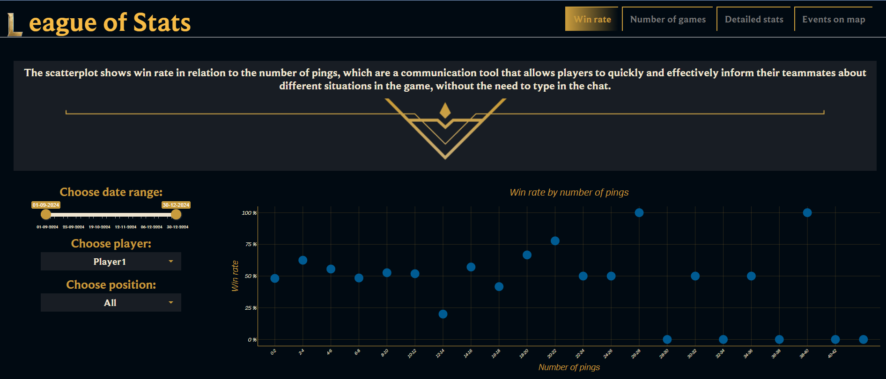
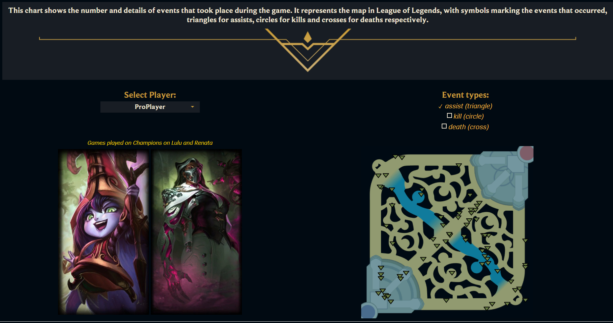

# League of Stats

League of Stats is a project that provides insights into your performance in League of Legends from September 1st to December 30th, 2024. The application presents meaningful and easy-to-understand statistics regarding your gameplay over several months. Additionally, for comparison, it includes data from a professional player.

The dashboard consists of four main tabs:

1. **Win rate**  
   Displays the percentage of games won by players, analyzed across various variables.

2. **Number of games**  
   Shows the total number of matches played.

3. **Detailed stats**  
   Highlights interesting performance-related statistics for players.

4. **Events on map**  
   Features a map indicating the locations of key events from recent games.

The rich variety of charts and the ability to filter data by date range or position allow for a precise understanding of player statistics. Furthermore, the comparison with a professional player reveals the differences between a seasoned professional and someone playing for fun.

---

Due to limitations in displaying the `heatmaply` package on shinyapps, we are not providing a link to the partially functioning product. We encourage you to run the application on your own computer to experience its full functionality. Below are example screenshots showcasing the application:

- **First**: The first tab  
  

- **ProMap**: The map tab  
  

